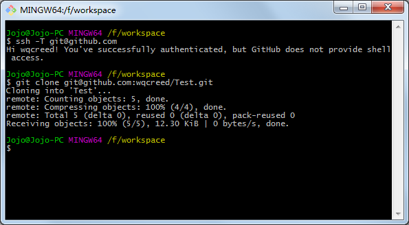

### git使用
   - git init 初始化 git 仓库
   - git status 查看状态，查看你当前 git 仓库的一些状态。
   - git add 文件名 或者 .(提交修改过的所有文件)   提交到暂存区
   - git commit -m '里面不能为空,描述此次修改信息' 提交到 Git仓库
   - git branch:  
      - branch 即分支的意思，分支的概念很重要，尤其是团队协作的时候，假设两个人都在做同一个项目，这个时候分支就是保证两人能协同合作的最大利器了。举个例子，A, B俩人都在做同一个项目，但是不同的模块，这个时候A新建了一个分支叫a， B新建了一个分支叫b，这样A、B做的所有代码改动都各自在各自的分支，互不影响，等到俩人都把各自的模块都做完了，最后再统一把分支合并起来。
      
      
### 连接github
- 有 http 和 ssh 
- 在github新建数据库后 复制第五行代码
- 链接github后提交git push origin master

### ssh 需要配置ssh keys
- 大多数 Git 服务器都会选择使用 SSH 公钥来进行授权。系统中的每个用户都必须提供一个公钥用于授权，没有的话就要生成一个。生成公钥的过程在所有操作系统上都差不多。首先你要确认一下本机是否已经有一个公钥。
   
#### 配置ssh keys
- 先输入 cd ~/.ssh   
- 然后 ls 命令查看是否有SSH 公钥看一下有没有id_rsa和id_rsa.pub(或者是id_dsa和id_dsa.pub之类成对的文件)，有 .pub 后缀的文件就是公钥，另一个文件则是密钥。

- 如果没有
	输入  ssh-keygen -t rsa -C "你的邮箱地址" 命令  出现" Your public key has been saved in /home/you/.ssh/id_rsa.pub.The key fingerprint is:xxx 然后一直按回车直到出现 ssh-keygen -t rsa -C '你的邮箱地址'" 一大段代码
    
- 然后输入命令(有.pub后缀的文件直接输入)  cat ~/.ssh/id_rsa.pub  命令获得公钥  复制 $ cat ~/.ssh/id_rsa.pub 下面的一大段代码

- 返回GitHub 点击setting > ssh and GPS keys > New SSH key 将复制的公钥粘贴到Key里 title自己取名字然后点击add key

- 完成后输入  ssh -T git@github+ .com 命令验证是否可以正常工作 出现The authenticity of host 'github.com (13.250.177.223)' can't be established.
RSA key fingerprint is SHA256:nThbg6kXUpJWGl7E1IGOCspRomTxdCARLviKw6E5SY8.
Are you sure you want to continue connecting (yes/no)?一大段代码  输入yes  出现Hi xxx! You've successfully authenticated, but GitHub does not # provide shell access.表示设置成功

### 如果换了一台电脑连接github 远程库
+ 先配置ssh key 
+ 然后 输入命令  git clone git@github.com:jalDing/notes.git 这句命令clone单词后面的在github点击“Clone or download”,复制就可以了 出现  代表成功
+ 输入 ls 
+ 输入 cd 你的github上的仓库名
##### 如果出现  Please tell me who you are  按照提示输入 
+ git config --global user.email "你的邮箱 回车
+ git config --global user.name "你的github用户名" 回车

+ 然后按照步骤 就可以正常上传你的文件了